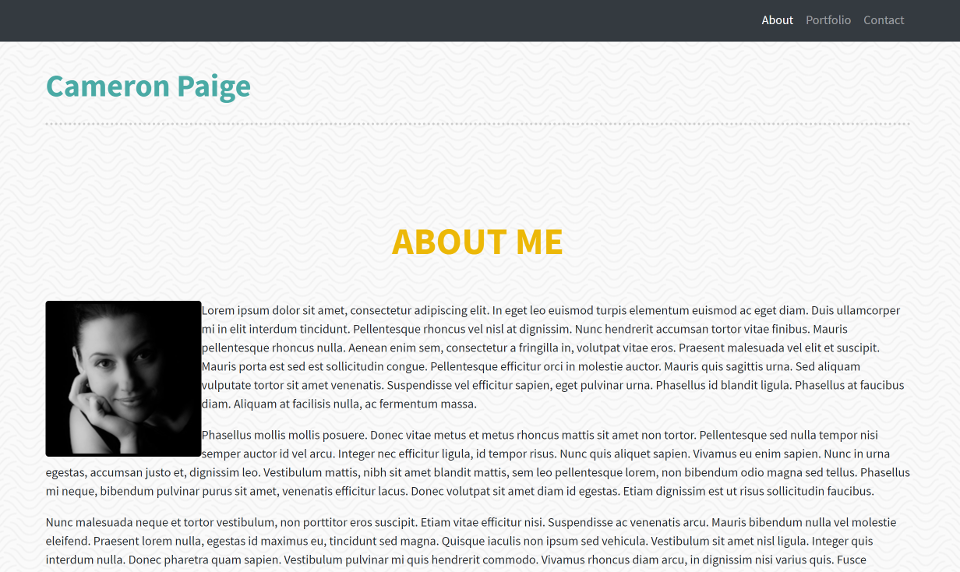

# Bootstrap Portfolio

Week 1 homework using Bootstrap components, snippets, templates, and themes.

-----

-----

## Usage

This basic personal website is built and can be modified using the included
files alone.

## Contributing

Fork away.

That said, this is a finished project for a class. It’s been graded, it’s done.
Let’s move on.

## License

This project is licensed under the MIT License - see the
[LICENSE.md](LICENSE.md) file for details

## Acknowledgments

This wouldn’t have been possible without these people and resources:

* https://getbootstrap.com

* https://startbootstrap.com

* https://mdbootstrap.com/freebies

* https://bootstrapmade.com

And there wouldn’t be a README without:

* https://www.makeareadme.com

* https://github.com/adam-p/markdown-here/wiki/Markdown-Cheatsheet

* http://www.writage.com

* https://medium.com/@meakaakka/a-beginners-guide-to-writing-a-kickass-readme-7ac01da88ab3

* http://tom.preston-werner.com/2010/08/23/readme-driven-development.html